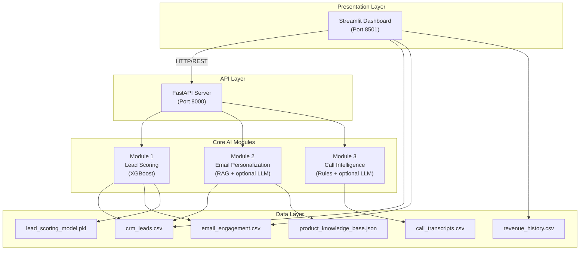
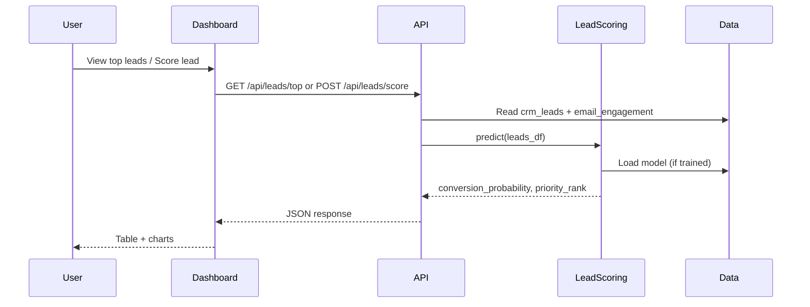
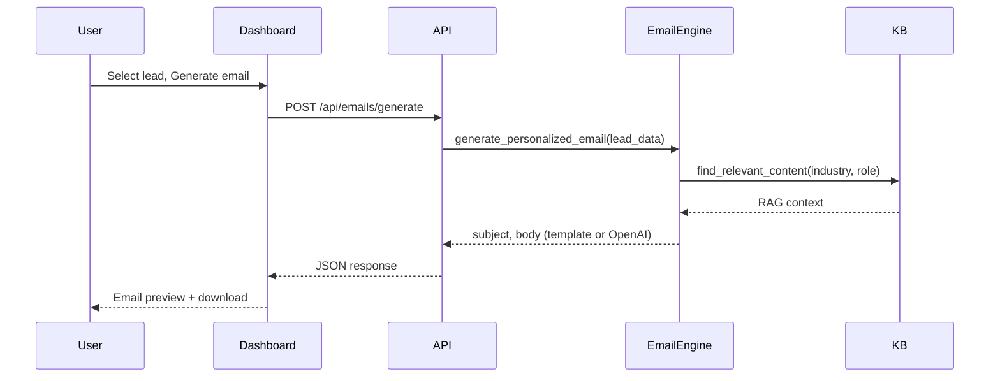
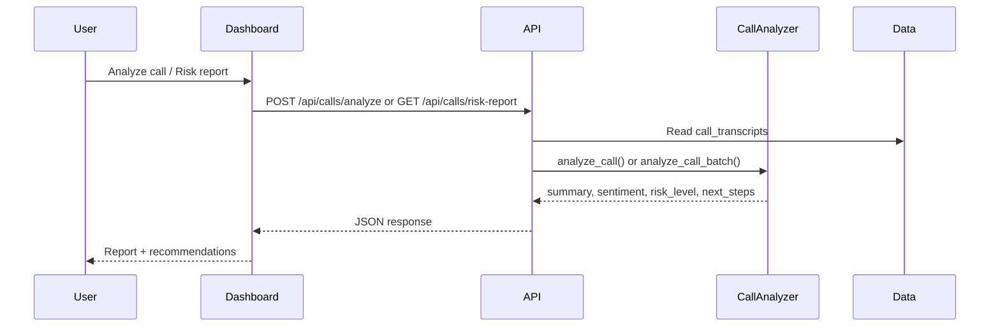

# AI Sales Acceleration Engine — Architecture

## High-Level Architecture

## Data Flow by Use Case

### 1. Lead Scoring

### 2. Email Personalization

### 3. Call Intelligence

## Component Overview

| Component | Tech | Purpose |
|-----------|------|---------|
| **Streamlit Dashboard** | Streamlit, Plotly | Single UI for overview, lead scoring, email gen, call analysis |
| **FastAPI** | FastAPI, Uvicorn | REST API; serves all three modules |
| **Lead Scoring** | XGBoost, scikit-learn, joblib | Train/predict conversion probability; persist model |
| **Email Personalization** | TF-IDF, optional OpenAI | RAG over product KB; generate personalized emails |
| **Call Intelligence** | Rules + optional OpenAI | Summarize calls, sentiment, risk, objections, next steps |
| **Data** | CSV, JSON | Synthetic CRM, email, calls, revenue; product KB; saved model |

## Optional Integration (OpenAI)

When `OPENAI_API_KEY` is set:

- **Email module:** Uses GPT for higher-quality, contextual email copy (fallback: templates).
- **Call module:** Uses GPT for richer summaries and risk/objection extraction (fallback: rule-based).

No API key is required for lead scoring or for running the full demo.
